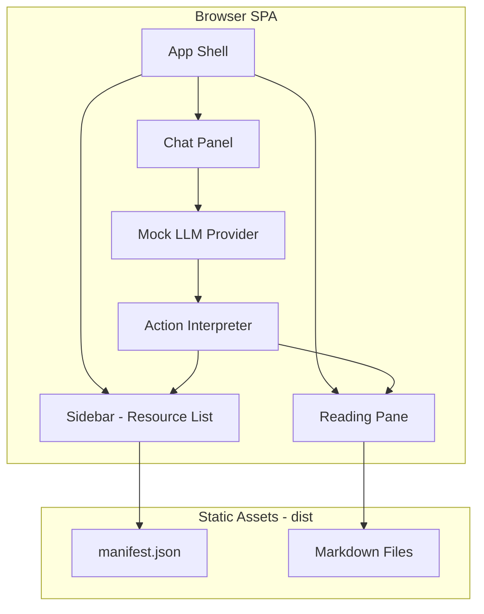

# Phase 1: Conversational UI SPA

## Architecture Overview



## Folder Structure

```
/klappy.dev
  /app                          # SPA source (Vite convention)
    /components
      App.jsx                   # Shell with split-pane layout
      Sidebar.jsx               # Resource navigation from manifest
      ReadingPane.jsx           # Markdown display + highlights
      ChatPanel.jsx             # Chat UI container
      ChatMessage.jsx           # Individual message component
      SuggestedQuestions.jsx    # Quick action buttons
    /lib
      manifest.js               # Fetch and parse manifest.json
      actions.js                # UI action interpreter
      markdown.js               # Markdown to HTML with heading IDs
    /providers
      types.js                  # Provider adapter interface
      mock.js                   # Mock provider with canned responses
    /hooks
      useAppState.js            # Centralized state (current doc, highlights, etc.)
    main.jsx                    # Entry point
    index.css                   # Global styles (semantic CSS variables)
  /public
    /content                    # Copied at build time
      manifest.json
      /canon/...
      /odd/...
      /about/...
      /projects/...
  vite.config.js
  package.json
```

## Key Data Structures

**Manifest Resource** (from `/public/content/manifest.json` — generated from per-file frontmatter):

```javascript
{
  uri: "klappy://canon/constraints",
  path: "/canon/constraints.md",
  title: "Constraints",
  type: "text/markdown",
  audience: "public" | "canon",
  tags: ["constraints", "assumptions"]
}
```

**UI Action** (from [PRD.md](../../docs/archive/PRD.md) Section 10):

```javascript
{ type: "open", payload: { uri: "klappy://canon/constraints" } }
{ type: "scroll_to", payload: { sectionId: "heading-id" } }
{ type: "highlight", payload: { sectionId: "heading-id" } }
{ type: "suggest_questions", payload: { questions: ["What are the constraints?", "Show me projects"] } }
```

**Chat Message**:

```javascript
{
  role: "user" | "assistant",
  text: "Short response text",
  actions: [/* UI actions to execute */]
}
```

**Provider Adapter Interface**:

```javascript
interface LLMProvider {
  respond(
    userMessage: string,
    context: AppContext
  ): Promise<{
    text: string,
    actions: UIAction[],
  }>;
}
```

## Implementation Steps

### Step 1: Project Scaffold

- Initialize Vite + React project in `/app`
- Configure build to copy content files to `/dist/content`
- Set up CSS with semantic variables (light theme first)
- Minimal dependencies: `react`, `react-dom`, `marked` (for markdown)

### Step 2: Manifest Loading + Sidebar

- Fetch `/content/manifest.json` on app load
- Render sidebar with grouped resources (by audience or tags)
- Handle resource selection (update URL hash or state)

### Step 3: Markdown Rendering + Anchors

- Fetch markdown by path from manifest
- Parse with `marked`, generate heading IDs (slugified)
- Render in reading pane with CSS for highlight animation
- Implement `scroll_to` and `highlight` via DOM + CSS class

### Step 4: Chat UI + Action Interpreter

- Chat panel with message list + input
- Action interpreter that executes actions:
  - `open(uri)` - update current resource
  - `scroll_to(id)` - smooth scroll + flash
  - `highlight(id)` - add highlight class
  - `suggest_questions(qs)` - show quick buttons
- Pipe assistant responses through interpreter

### Step 5: Mock Provider

- Pattern-match user input against keywords
- Return short text + relevant actions
- Example responses:
  - "constraints" -> open constraints doc + scroll to first section
  - "who are you" -> open bio + suggest follow-ups
  - "projects" -> open projects index

### Step 6: Polish + Evidence

- Ensure responsive split-pane layout
- Test all action types work
- Capture screenshots showing:
  - Document navigation
  - Scroll/highlight in action
  - Short assistant responses
- Write completion report

## Dependencies (Minimal)

- `vite` - Build tool
- `react` / `react-dom` - UI
- `marked` - Markdown parsing
- No Tailwind (per preference) - semantic CSS only

## Files to Reference

- `/public/content/manifest.json` - Generated content inventory
- [PRD.md](../../docs/archive/PRD.md) - Behavior contract, UI actions (Section 10)
- [BUILD_PROMPT_PHASE1.md](../../docs/archive/projects/repo-as-a-system/BUILD_PROMPT_PHASE1.md) - Phase 1 requirements

## Definition of Done

1. `npm install && npm run dev` starts the app
2. Sidebar shows resources from manifest
3. Clicking a resource renders its markdown with heading anchors
4. Chat accepts input and triggers UI actions
5. Mock provider returns short text + actions
6. Visual proof captured (screenshots)
7. Build passes, ready for Cloudflare Pages deploy
