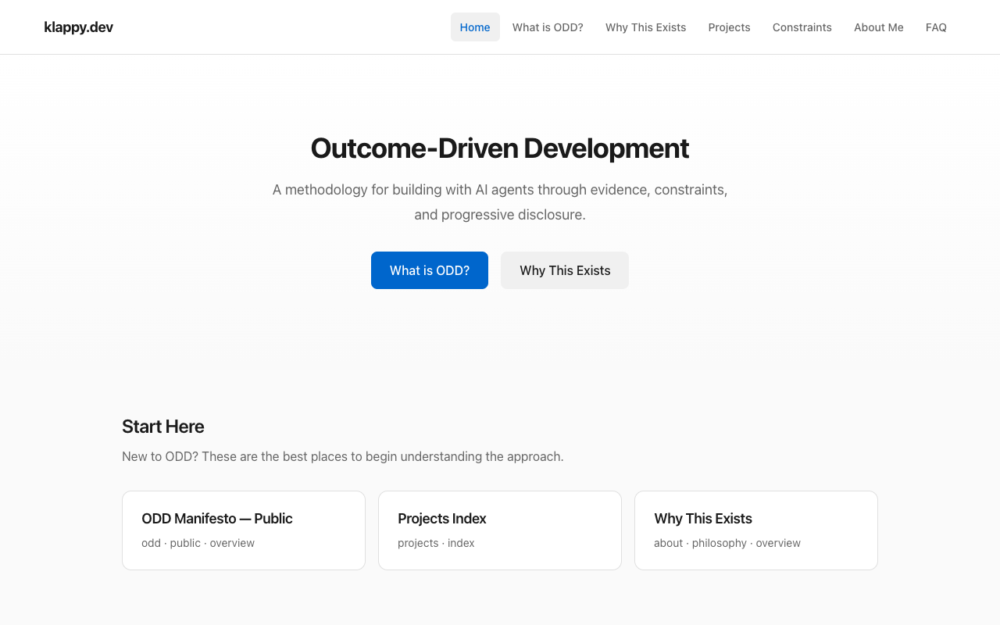
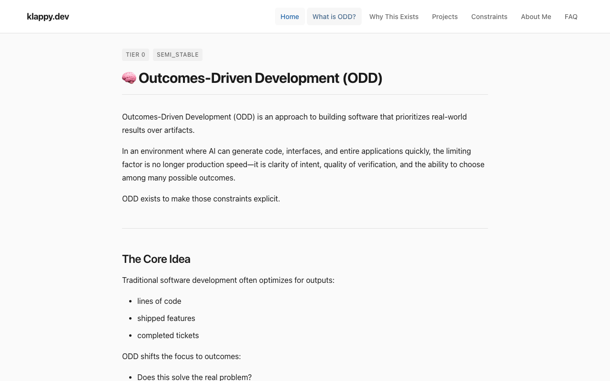
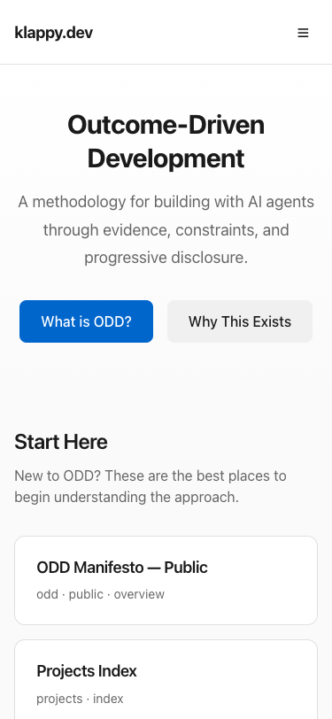

# Evidence — Website Lane (Run 71c6fdc7)

## Screenshots

### 01-home-desktop.png
Home page on desktop viewport (1280x800). Shows:
- Navigation with exactly 7 items
- Hero section with call-to-action buttons
- "Start Here" section with Tier 0 content cards
- "Go Deeper" section with Tier 1 content cards

### 02-odd-page.png
ODD Manifesto page showing markdown content rendering:
- Content fetched from `/content/odd/README.md`
- Proper heading hierarchy
- Readable typography
- Metadata badges showing tier and stability

### 03-home-mobile.png
Home page on mobile viewport (375x812). Shows:
- Responsive layout without horizontal scrolling
- Mobile navigation (hamburger menu visible)
- Content properly stacked for mobile reading

## PRD Success Criteria Verification

| Criteria | Status | Evidence |
|----------|--------|----------|
| First load shows ≤7 nav items | ✅ PASS | Screenshot 01: Navigation shows exactly 7 items |
| Mobile usable without horizontal scrolling | ✅ PASS | Screenshot 03: Mobile layout fits screen |
| Canon discoverable without file paths | ✅ PASS | Screenshots show human-readable titles, not paths |
| No agent instructions in UI | ✅ PASS | Screenshots show no CLI/process language |
| Deep links work | ✅ PASS | Screenshot 02: Hash URL `#/odd/README.md` loads content |
| Progressive disclosure tiers | ✅ PASS | Screenshots 01 shows Tier 0/1 content organization |

## Build Output

- Build command: `npm run build -- --lane website`
- Output directory: `products/website/dist/`
- Evidence available at: `/_evidence/`

## Deployment URLs

**LIVE DEPLOYMENT VERIFIED:**

- Preview URL: https://website-attempt-test.klappy-dev-website.pages.dev/
- Evidence URL: https://website-attempt-test.klappy-dev-website.pages.dev/_evidence/
- Cloudflare Project: `klappy-dev-website`

### Verification Results

| Requirement | Status | Details |
|-------------|--------|---------|
| Branch pushed | ✅ PASS | Commit d1be3bd pushed to origin |
| Cloudflare builds | ✅ PASS | klappy-dev-website project deployed |
| App loads | ✅ PASS | HTTP 200 at preview URL |
| /_evidence/ works | ✅ PASS | HTTP 200, index.html/json served |
| Screenshots present | ✅ PASS | 3 screenshots in evidence |
